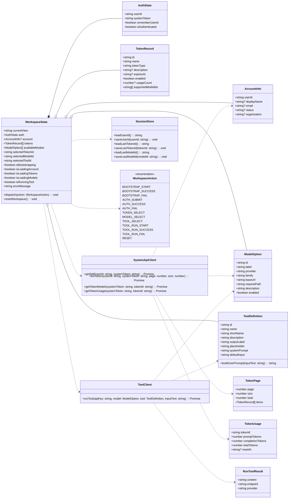
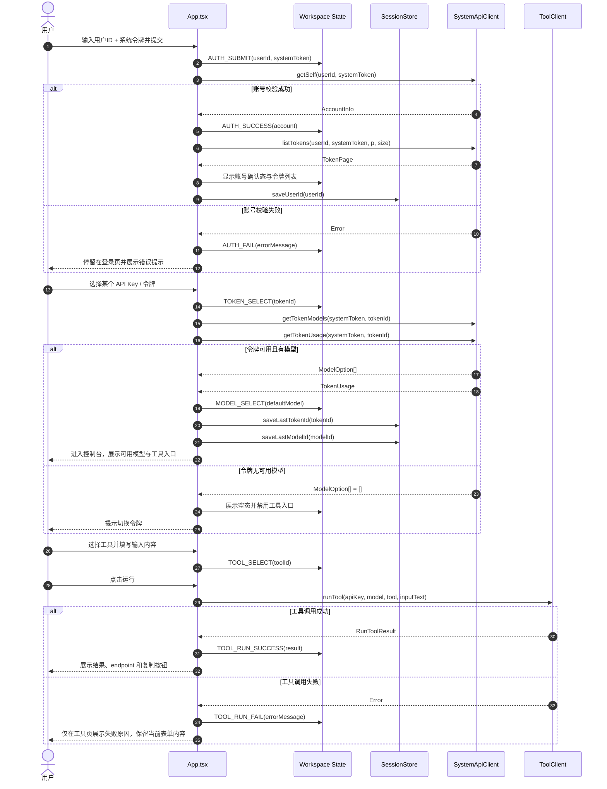
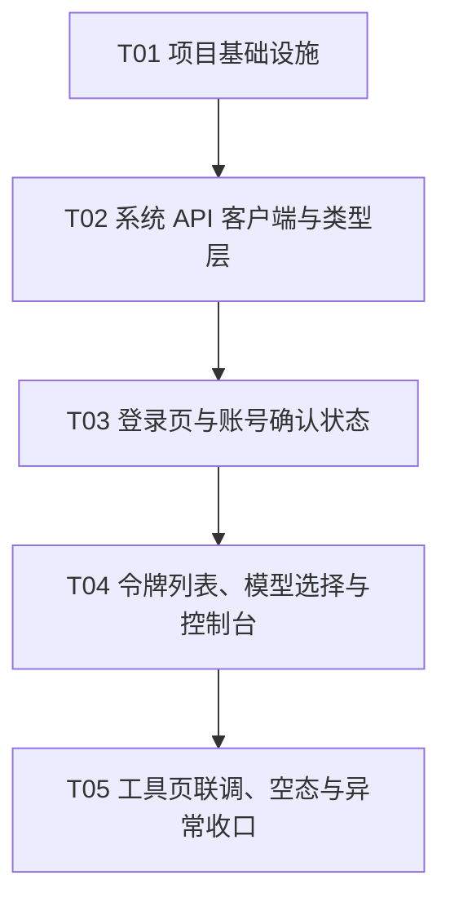

# 赛博小羊的 ai 工具箱增量架构设计

## Part A：System Design

### 1. Implementation Approach

#### 设计目标
- 这是一个纯前端静态站点，核心目标不是“增加更多层”，而是把登录、令牌选择、模型选择、工具调用这条主链路做清楚。
- 将“系统令牌”和“API Key（模型调用令牌）”分离，避免用户把两类凭证混用。
- 把账号确认、令牌列表、模型选择、控制台、工具页做成一个清晰的渐进式工作流，减少一次性暴露过多信息。
- 尽量复用现有请求封装和 UI 组件，控制改动面，避免引入不必要的新依赖。

#### 难点与处理方式
1. **两类凭证容易混淆**
   - 登录页必须明确区分：
     - `系统令牌`：用于查询账号信息、令牌列表、令牌使用情况。
     - `API Key（模型调用令牌）`：用于查询该令牌支持的模型，以及后续工具调用。
   - UI 上用不同标题、不同颜色提示、不同空状态文案，强制用户在概念上分开。

2. **前端直连多个系统 API**
   - 登录后需要按顺序调用 `GET /api/user/self`、`GET /api/token/`、`GET /v1/models`、`GET /api/usage/token/`。
   - 建议抽出 `systemApiClient` 统一处理 header、错误解析、分页参数和模型列表适配。
   - 工具调用继续沿用现有 `sheepaiClient`，只负责模型推理请求，不掺杂账号/令牌查询逻辑。

3. **页面状态较多，但不适合上重型路由/状态管理**
   - 推荐使用一个轻量的“状态机式”页面模型：`login -> account-confirm -> token-list -> model-picker -> console -> tool`。
   - 实现上优先使用 `useReducer` 或受控状态对象，不新增全局状态库。
   - 如果后续需要刷新后保持步骤、地址栏直达某一步，再考虑引入极轻量的 hash 路由；当前阶段不建议。

4. **空态、失败态、无模型态必须前置处理**
   - 账号信息失败：停止后续流程，提示用户检查系统令牌。
   - 令牌列表为空：提示没有可用 API Key，并引导用户返回上一步。
   - 模型列表为空：保留令牌信息，但禁用工具页入口，并提示该令牌不可用于当前模型。
   - 工具调用失败：只影响当前工具页，不回滚登录态和令牌选择态。

#### 框架与库选择
- **React + TypeScript**：继续使用，适合把登录流程和工作流状态写成强类型状态机。
- **Vite**：继续使用，维持纯前端静态站点的低门槛构建方式。
- **Tailwind CSS + shadcn/ui**：继续使用，适合快速做出高可读性的分步表单、卡片、表格和提示状态。
- **lucide-react**：继续使用，足以覆盖登录、提示、状态反馈图标。
- **不新增状态管理库**：当前需求不需要 Redux / Zustand / XState；`useReducer` + 派生状态即可。
- **不强制新增路由库**：当前是单页渐进式流程，路由只会增加复杂度。

#### 架构模式
- **整体模式**：单页应用 + 轻量工作流状态机。
- **层次划分**：
  - `UI 层`：`App.tsx` 负责页面态切换、卡片布局、文案与交互。
  - `Service 层`：`systemApiClient.ts` 负责系统 API；`sheepaiClient.ts` 负责模型/工具调用。
  - `Data 层`：`models.ts`、`toolDefinitions.ts`、`types/sheepai.ts` 负责静态定义、类型与映射。
- **设计原则**：简洁、低学习成本、强提示、纯前端、最小改动面。

### 2. File List

| 路径 | 角色 | 变更建议 |
|---|---|---|
| `package.json` | 依赖与脚本 | 仅在确实需要时新增依赖；默认不新增路由/状态库 |
| `vite.config.ts` | 构建配置 | 保持现有配置，除非需要别名或基础路径调整 |
| `tsconfig.json` | TypeScript 配置 | 保持现有配置 |
| `tsconfig.app.json` | 应用侧 TS 配置 | 保持现有配置 |
| `index.html` | 应用入口 | 保持现有配置 |
| `src/main.tsx` | React 入口 | 仅在需要全局 provider 时微调 |
| `src/index.css` | 全局样式 | 补充分步页、空态、表格/卡片间距的基础样式 |
| `src/App.css` | 页面级样式 | 处理登录页、控制台页、工具页的布局与视觉层级 |
| `src/App.tsx` | 页面状态机与编排 | 重构为登录/令牌/模型/控制台/工具页主流程 |
| `src/lib/systemApiClient.ts` | 系统 API 封装（新） | 封装账号、令牌、模型、使用情况查询 |
| `src/lib/sheepaiClient.ts` | 工具调用封装 | 继续只做模型推理请求与响应提取 |
| `src/lib/sessionStore.ts` | 轻量会话缓存（新） | 仅缓存非敏感偏好，如用户 ID、上次选中的 token/model |
| `src/types/sheepai.ts` | 类型定义 | 补充账号、令牌、模型、工作流状态相关类型 |
| `src/data/models.ts` | 模型元数据 | 增加从令牌模型列表映射到 UI 展示的适配逻辑 |
| `src/data/toolDefinitions.ts` | 工具定义 | 保持现有工具集合，供控制台与工具页复用 |

### 3. Data Structures and Interfaces

### 4. Program Call Flow

### 5. Anything UNCLEAR

- `/api/user/self`、`/api/token/`、`/api/usage/token/` 的响应字段结构未完全给出，前端需要做一层适配，避免强绑定返回 JSON 的具体字段名。
- `GET /v1/models` 在“系统令牌”和“API Key”两种凭证上的可用性边界未完全明确，当前设计按“选中的 API Key”优先查询模型，并保留用系统令牌兜底的能力。
- 系统令牌是否允许持久化到本地存储未明确，默认建议**不持久化**，只保留用户 ID 或最近一次选择的 token/model 标识。
- 令牌列表是否需要分页切换、搜索、置顶收藏未明确，本阶段只做最小分页展示。

## Part B：Task Decomposition

### 6. Required Packages

本次改造**不强制新增**第三方包，优先复用现有技术栈。

- `react@^19.2.0`: UI 框架
- `react-dom@^19.2.0`: DOM 渲染
- `lucide-react@^0.562.0`: 图标
- `clsx@^2.1.1`: 条件 class 拼接
- `tailwind-merge@^3.4.0`: Tailwind class 合并
- `zod@^4.3.5`: 可选的表单/状态校验
- `react-hook-form@^7.70.0`: 可选的表单管理

> 说明：如果后续发现登录表单需要更强的校验与错误提示，再按需启用 `zod` + `react-hook-form`，当前不是硬性依赖。

### 7. Task List（ordered by dependency）

| Task ID | Task Name | Source Files | Dependencies | Priority |
|---|---|---|---|---|
| T01 | 搭建项目基础设施并稳定入口 | `package.json`, `vite.config.ts`, `tsconfig.json`, `tsconfig.app.json`, `src/main.tsx`, `src/index.css`, `index.html` | 无 | P0 |
| T02 | 抽出系统 API 客户端与类型层 | `src/lib/systemApiClient.ts`, `src/types/sheepai.ts`, `src/data/models.ts`, `src/data/toolDefinitions.ts` | T01 | P0 |
| T03 | 重构登录页与账号确认状态 | `src/App.tsx`, `src/App.css`, `src/lib/sessionStore.ts` | T02 | P0 |
| T04 | 接入令牌列表、模型选择与控制台状态机 | `src/App.tsx`, `src/lib/sheepaiClient.ts`, `src/data/models.ts`, `src/data/toolDefinitions.ts` | T03 | P0 |
| T05 | 完成工具页联调、空态与异常收口 | `src/App.tsx`, `src/lib/systemApiClient.ts`, `src/lib/sheepaiClient.ts`, `src/index.css` | T04 | P1 |

### 8. Shared Knowledge

- 所有系统 API 请求都必须显式带上 `new-api-user` 和 `Authorization`，并按接口区分 system token 与 API Key 的用途。
- `systemToken` 只用于账号、令牌、使用情况和模型列表查询；`selectedToken` / `API Key` 只用于模型调用与工具调用。
- 页面状态采用单向流转，不做复杂双向绑定；登录失败不会污染已选令牌和模型，除非用户显式重置。
- 本地缓存只保存低敏感信息，例如用户 ID、上次选择的 token/model 标识；不默认保存原始系统令牌。
- 所有异步请求都要有独立 loading 与 error 状态，避免“点了按钮但页面无反馈”。
- 纯前端直连 API，不能假设有后端代理层来替用户重试、转发或脱敏。

### 9. Task Dependency Graph

